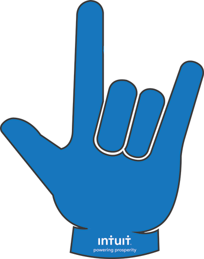

<div align="center">
  
  <h1>accessibility-snippets</h1>
  
<!-- ALL-CONTRIBUTORS-BADGE:START - Do not remove or modify this section -->
[](#contributors-)
<!-- ALL-CONTRIBUTORS-BADGE:END -->

  <p>VScode Snippets created to help developers write accessible code.</p>
</div>

## Features

### CSS snippet

- reduced motion - adds a reduced motion snippet with prefix `transition`

- dark-color-scheme - adds dark prefers-color-scheme snippet with prefix `darkColorScheme`

### React Aria Snippets

- **AlertAria** - Add `role='alert'` to a node containing an alert message. Setting role='alert' automatically sets aria-live="assertive" and aria-atomic="true".

- **AlertDialogAria** - Add `role='alertDialog'` when an alert is urgent and demands immediate attention. Only use alertDialog when the alert message has associated interactive controls.

- **ArticleAria** - Add `role='article'` to a node that can easily stand on its own separate from the main content of the page. An example is a newspaper article or a forum post. Use `aria-posinset` to indicate of the article within the feed. Use `aria-setsize` to indicate how many articles are in the feed.

- **BannerAria** - Add `role='banner'` to define a banner landmark to assistive technologies. A banner landmark is informative content frequently placed at the beginning of the page.

- **ButtonAria** - Add `role='button'` on a clickable element that triggers a response when activated by a user. Add `aria-pressed` when a button can toggle 'on' or 'off'. Add `aria-expanded` if a button triggers another node to expand or collapse.

- **CheckboxAria** - Add `role='checkbox'` to a checkable interactive control. Add `aria-checked` to indicate the state of the checkbox.

- **ComboboxAria** - Add `role='combobox'` to a composite widget containing a single-line textbox and another element such as listbox. Add `aria-haspopup` if the combobox contains a popup. Add `aria-expanded` if the combobox expands or collapses a node. Add `aria-owns` to indicate which elements the combobox owns.

- **DialogAria** - Add `role='dialog'` to a window separate from the rest of the webpage like a modal.

- **DocumentAria** - Add `role='document'` to application or other interactive widget role to switch to browse or read mode. Add `aria-expanded` to indicate whether the document is currently expanded or collapsed if the document element is collapsible.

- **FeedAria** - Add `role='feed'` to a dynamic list of articles. Add `aria-busy` if articles are being loaded or have been removed from the feed.

- **ImageAria** - Add `role='img'` to identify a set of content as a single image that has multiple elements. Elements can be images, text, emojis or other content that delivers information visually. Add `aria-label` for descriptive alt text for the image. `aria-label` can be replaced with `aria-labelledby` if descriptive text is provide in another element within the role.

- **LinkAria** - Add `role='link'` to elements that act as hyperlinks. Ensure the link can be navigated to via the keyboard. If the link role is added to an image add `alt` text. Add an `aria-label` if the link does not provide a descriptive text label.

- **LoadingAria** - Add `role='status'` and `aria-live='polite'` to element wrapping a loading spinner or indicator. The live region must be present in the DOM before the loading indicator has rendered. Add `aria-label='Loading'` to loading indicator if no other text element or content is passed.

- **RadioAria** - Add `role='radio'` to a checkable interactive control. Use radio in place of checkbox if only one item in a group can be checked. Add `aria-checked` to indicate the state of the checkbox.

- **SearchboxAria** - Add `role='searchbox'` to a textbox intended for specifying search criteria. Add `aria-activedescendant` to indicate the current active child (for example if the textbox has an autocomplete popup and the focus changes to the popup). Add `aria-autocomplete` to indicate if the textbox will display a list of suggestions. Use `aria-multiline` if the textbox can contain multiple lines of input. Add `aria-placeholder` to give users a hint of what the input should contain. Add `aria-readonly` if the user cannot modify the value. Add `aria-required` if the field is required.

- **SliderAria** - Add `role='slider'` to allow users to select from a certain range. Add `aria-orientation` to indicate what direction the slider is oriented in. Add `aria-valuemin` to indicate the minimum value. Add `aria-valuemax` to indicate the maximum value. Add `aria-valuenow` to indicate the current value. If the value is not represented by a number add `aria-valuetext` in place of aria-valuenow.

- **SwitchAria** - Use `role='switch'` on checkboxes that represent an 'on' or 'off' state. Add `aria-checked` to indicate whether component is on or off. Add `aria-required` if the field is required.

- **TextboxAria** - Use `role='textbox'` on elements that allow input of free-form text. Add `aria-activedescendant` to indicate the current active child (for example if the textbox has an autocomplete popup and the focus changes to the popup). Add `aria-autocomplete` to indicate if the textbox will display a list of suggestions. Use `aria-multiline` if the textbox can contain multiple lines of input. Add `aria-placeholder` to give users a hint of what the input should contain. Add `aria-readonly` if the user cannot modify the value. Add `aria-required` if the field is required.

- **TimerAria** - Add `role='timer'` to indicate to assistive technologies that an element is a numerical counter listing the amount of elapsed time from a starting point or the remaining time until an end point. Add `aria-label` to provide the name of the timer. Add `aria-live` to explicitly denote a live region (Elements with the role timer have an implicit aria-live value of off). Add `aria-describedby` to indicate the idref of an element that contains additional instructions for navigating or operating this element. Add `aria-roledescription` o give the timer a more descriptive role text for screen readers to speak. Add `aria-atomic` to set whether or not the screen reader should always present the live region as a whole, even if only part of the region changes.

- **CellAria** - Adds `role='cell'` aria attributes for a cell. A cell is identified as an element in a tabular container that does not contain column or row header information. “cells” are only valid within a construct that simulates a standard data table.

## Rules of ARIA

- The **first rule** of ARIA is try to `use native HTML elements` instead of aria attributes whenever possible.

- The **second rule** of ARIA is do not change native HTML semantics, unless you really have to.

  Avoid:

  ```
  <h2 role=tab>heading tab</h2>
  ```

  Instead:

  ```
  <div role=tab><h2>heading tab</h2></div>
  ```

- The **third rule** of ARIA all aria controls must be usable by the keyboard.

- The **fourth rule** of ARIA do not use role='presentation' and aria-hidden='true' on focusable elements.

- The **fifth rule** of ARIA all interactive elements must have accessible names.

## Installation

- Please follow the VSCode instructions to install accessibility-snippets in your editor:

  ```
  https://code.visualstudio.com/docs/editor/userdefinedsnippets#_install-snippets-from-the-marketplace
  ```

- Once installed Navigate to Settings in vscode's preferences menu and toggle **on** `Editor: Accept Suggestion On Enter`
  > Controls whether suggestions should be accepted on Enter, in addition to Tab. Helps to avoid ambiguity between inserting new lines or accepting suggestions.

## Contributing

Contributions are welcome! If you encounter problems or have a feature suggestion we'd love to hear about it. Open an issue in the GitHub issue tracker and we will do our best to provide support. Thank you!

## License

`accessibility-snippets` is provided under the MIT license.

## Contributors ✨

Thanks goes to these wonderful people ([emoji key](https://allcontributors.org/docs/en/emoji-key)):

<!-- ALL-CONTRIBUTORS-LIST:START - Do not remove or modify this section -->
<!-- prettier-ignore-start -->
<!-- markdownlint-disable -->
<table>
  <tr>
    <td align="center"><a href="https://github.com/kendallgassner"><br /><sub><b>Kendall Gassner</b></sub></a><br /><a href="https://github.com/kendall Gassner/accessibility-snippets/commits?author=kendallgassner" title="Code">💻</a> <a href="https://github.com/kendall Gassner/accessibility-snippets/commits?author=kendallgassner" title="Documentation">📖</a> <a href="#ideas-kendallgassner" title="Ideas, Planning, & Feedback">🤔</a> <a href="#infra-kendallgassner" title="Infrastructure (Hosting, Build-Tools, etc)">🚇</a></td>
    <td align="center"><a href="https://github.com/kharrop"><br /><sub><b>Kelly Harrop</b></sub></a><br /><a href="https://github.com/kendall Gassner/accessibility-snippets/commits?author=kharrop" title="Documentation">📖</a></td>
    <td align="center"><a href="https://digantakrbanik.codes/"><br /><sub><b>Diganta Kr Banik</b></sub></a><br /><a href="https://github.com/kendall Gassner/accessibility-snippets/commits?author=developer-diganta" title="Documentation">📖</a></td>
    <td align="center"><a href="https://github.com/raych2"><br /><sub><b>Rachel Tongco</b></sub></a><br /><a href="https://github.com/kendall Gassner/accessibility-snippets/commits?author=raych2" title="Documentation">📖</a></td>
    <td align="center"><a href="https://github.com/aylinmarie"><br /><sub><b>Aylin</b></sub></a><br /><a href="https://github.com/kendall Gassner/accessibility-snippets/commits?author=aylinmarie" title="Documentation">📖</a> <a href="https://github.com/kendall Gassner/accessibility-snippets/commits?author=aylinmarie" title="Code">💻</a></td>
    <td align="center"><a href="https://github.com/jeffreyclu"><br /><sub><b>Jeffrey Lu</b></sub></a><br /><a href="https://github.com/kendall Gassner/accessibility-snippets/commits?author=jeffreyclu" title="Documentation">📖</a> <a href="https://github.com/kendall Gassner/accessibility-snippets/commits?author=jeffreyclu" title="Code">💻</a></td>
    <td align="center"><a href="https://github.com/Saran51"><br /><sub><b>Saran51</b></sub></a><br /><a href="https://github.com/kendall Gassner/accessibility-snippets/commits?author=Saran51" title="Documentation">📖</a> <a href="https://github.com/kendall Gassner/accessibility-snippets/commits?author=Saran51" title="Code">💻</a></td>
  </tr>
</table>

<!-- markdownlint-restore -->
<!-- prettier-ignore-end -->

<!-- ALL-CONTRIBUTORS-LIST:END -->

This project follows the [all-contributors](https://github.com/all-contributors/all-contributors) specification. Contributions of any kind welcome!
